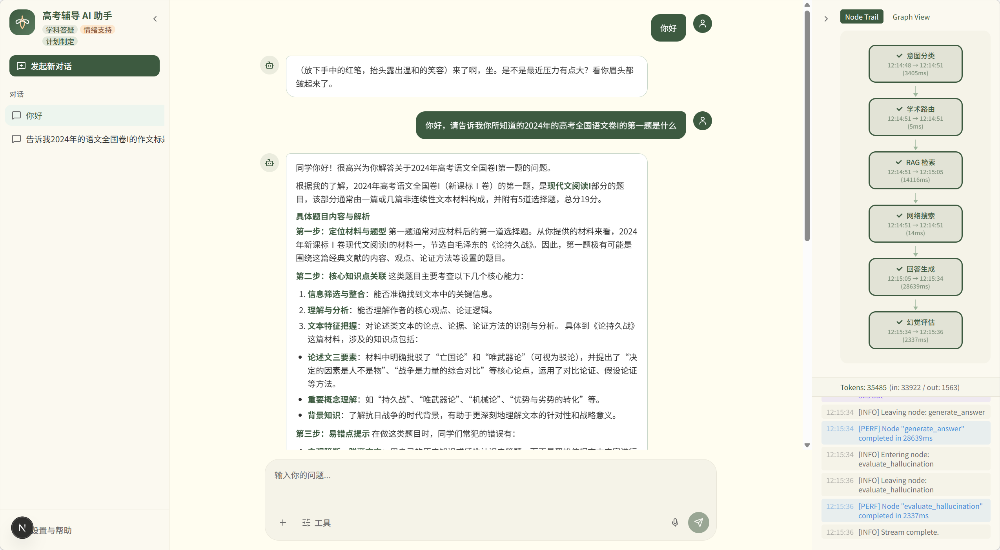
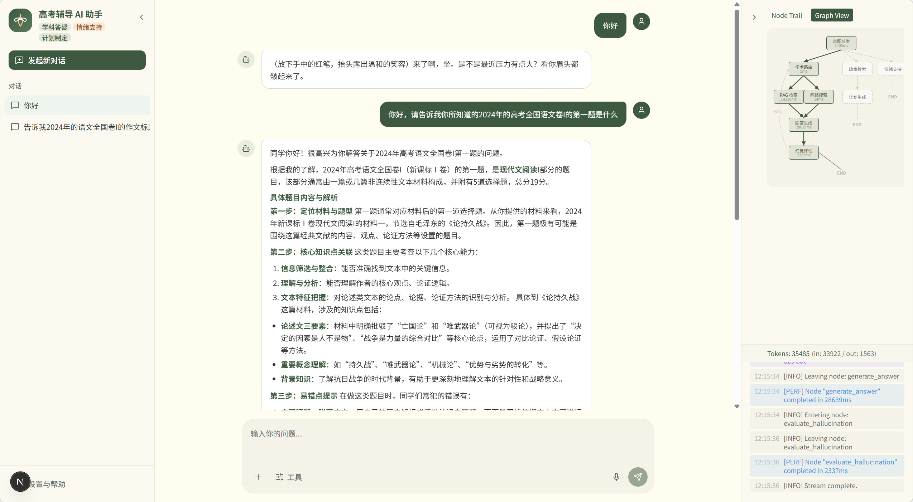

# Gaokao Tutor

<p align="center">
  <a href="README_zh.md">中文文档</a> ·
  <a href="docs/architecture/v0.2.0/diagram_design.md">Architecture Diagrams</a> ·
  <a href="CHANGELOG.md">Changelog</a>
</p>

<p align="center">
  
  
  
  /gaokao_tutor/actions/workflows/ci.yml/badge.svg" alt="CI" />
</p>

A production-oriented, multi-agent conversational AI for Chinese Gaokao preparation. Built on **LangGraph** (stateful orchestration), **FastAPI** (SSE streaming), and **Next.js** (reactive frontend). A lightweight Qwen2.5-7B supervisor routes queries to three specialized agents — subject tutor, study planner, and emotional support — each backed by a fully observable, fault-tolerant pipeline.

---

## Demo





---

## What's New in v0.2.0

- **Hybrid RAG**: Three-stage retrieval — ChromaDB vector search + BM25 keyword search (jieba tokenization) + BGE Reranker (SiliconFlow API). Meaningfully higher recall than pure vector search.
- **Enriched SSE Stream**: Every `node_event` now carries `duration_ms` and `error` fields. A new `usage` event type surfaces per-node token consumption in real time.
- **Graph DAG Visualization**: Right panel tab toggle — "Node Trail" (sequential) vs "Graph View" (full topology with live node state).
- **Token Usage Display**: Per-session running total (input / output / total tokens) in the frontend right panel.
- **Centralized LLM Factory**: `get_node_llm()` unifies all four graph modules. Supervisor now routes via **Qwen2.5-7B on SiliconFlow** (fast, low-latency) while generation nodes retain DeepSeek-V3.
- **Cross-Provider Fallback**: SiliconFlow + Qwen2.5-7B as the secondary provider, giving true cross-infrastructure failover.

---

## Core Features

- **Academic Q&A** — Hybrid RAG (vector + BM25 + reranker) with parallel fan-out/fan-in, hallucination evaluation and automatic retry loop
- **Study Planner** — Personalized revision schedules enriched with live Gaokao policy data via web search
- **Emotional Support** — Warm, practical responses in the persona of an experienced homeroom teacher
- **Intent Routing** — Lightweight Qwen2.5-7B supervisor classifies intent and dispatches to the right workflow at low latency
- **LLM Fallback** — Automatic failover to SiliconFlow (Qwen2.5-7B) when the primary DeepSeek API times out or returns 5xx
- **Distributed Tracing** — OpenTelemetry instrumentation across all graph nodes, exported to Jaeger (OTLP) with SQLite fallback
- **State Persistence** — PostgreSQL-backed LangGraph checkpointer for multi-turn conversation memory (graceful stateless degradation if DB unavailable)
- **Configuration-Driven** — YAML runtime parameters + XML prompt registry; modify behavior without touching code
- **Real-Time Observability** — SSE-driven reasoning path (node trail or DAG view), per-node timing, error stream, and token usage display
- **Markdown Rendering** — Full GFM support: tables, code blocks, math formulas (LaTeX), lists

---

## Architecture

```text
User ──► Next.js (SSE consumer) ──► FastAPI /stream ──► LangGraph StateGraph
                                                            │
                              ┌─────────────────────────────┼──────────────────────┐
                              ▼                             ▼                      ▼
                         [academic]                    [planning]            [emotional]
                      ┌──────┴──────┐                      │                      │
                      ▼             ▼                       ▼                      ▼
               rag_retrieve    web_search            search_policy       emotional_response
               (ChromaDB       (DuckDuckGo)               │
                +BM25+Rerank)       │                      ▼
                      └──────┬──────┘               generate_plan ──► END
                             ▼
                       generate_answer
                             │
                             ▼
                    evaluate_hallucination
                       ┌─────┴────┐
                    [retry]     [end]
                       │
                  academic_router (loop)
```

Cross-cutting: `@traced_node` on every node → OpenTelemetry → Jaeger UI / SQLite.
All nodes share `TutorState` as the single source of truth.

See [`docs/architecture/v0.2.0/diagram_design.md`](docs/architecture/v0.2.0/diagram_design.md) for detailed Mermaid diagrams.

---

## Tech Stack

| Layer | Component | Detail |
| ----- | --------- | ------ |
| Frontend | Next.js 16 + Tailwind CSS 4 | Reactive chat UI, SSE consumer, Markdown renderer |
| Backend API | FastAPI + Uvicorn | SSE endpoint (`POST /stream`), CORS, OTel auto-instrumentation |
| Orchestration | LangGraph | StateGraph with fan-out/fan-in, conditional edges, retry loop |
| Routing LLM | Qwen2.5-7B (SiliconFlow) | Lightweight intent classifier (temperature=0.0) |
| Generation LLM | DeepSeek-V3 | Academic answers, study plans, emotional support |
| LLM Fallback | Qwen2.5-7B (SiliconFlow) | Cross-provider failover on timeout / 5xx |
| Vector Store | ChromaDB | Local knowledge retrieval with L2→relevance normalization |
| Embedding | BAAI/bge-m3 (SiliconFlow) | Text vectorization for RAG |
| Keyword Search | rank-bm25 + jieba | Chinese-aware BM25 retrieval |
| Reranker | BAAI/bge-reranker-v2-m3 (SiliconFlow) | Cross-encoder reranking of merged candidates |
| Web Search | DuckDuckGo | Online retrieval for study planner and academic fallback |
| State Persistence | PostgreSQL (psycopg) | Multi-turn memory via LangGraph checkpointer |
| Observability | OpenTelemetry + Jaeger + SQLite | Distributed tracing across all graph nodes |
| Configuration | YAML + XML | Runtime settings and prompt templates |

---

## Quick Start

### Prerequisites

- Python 3.11+
- Node.js 18+ and npm
- [Conda](https://docs.conda.io/) (recommended)
- PostgreSQL (optional — state persistence; system runs stateless without it)
- Jaeger 2.x (optional — trace visualization)

### Backend Setup

```bash
git clone https://github.com/<your-username>/gaokao_tutor.git
cd gaokao_tutor

conda create -n gaokao_tutor python=3.11 -y
conda activate gaokao_tutor

pip install -r requirements.txt

cp .env.example .env
# Fill in .env:
#   DEEPSEEK_API_KEY        — DeepSeek API key (primary LLM)
#   SILICONFLOW_API_KEY     — SiliconFlow key (embedding, reranker, routing LLM, fallback)
#   DB_URI                  — PostgreSQL URI (optional)
```

### Build Knowledge Base

Place exam paper `.txt` / `.pdf` files under `data/chinese/` or `data/math/`, then:

```bash
python scripts/build_index.py
```

### Frontend Setup

```bash
cd frontend
npm install
```

### Run

```bash
# Terminal 1 — Backend
uvicorn app:app --reload --port 8000

# Terminal 2 — Frontend
cd frontend
npm run dev
```

Frontend: `http://localhost:3000` · Backend API: `http://localhost:8000`

### Optional: Jaeger Tracing

```bash
# Traces visible at http://localhost:16686
./local_tools/jaeger-2.15.0-windows-amd64/jaeger.exe
```

---

## Project Structure

```text
gaokao_tutor/
├── app.py                        # FastAPI SSE endpoint + lifespan (tracing, checkpointer, graph)
├── config/
│   ├── settings.yaml             # Runtime parameters (temperatures, timeouts, retry limits)
│   └── prompts/                  # XML prompt templates (8 files: supervisor, academic, planner,
│                                 #   emotional, hallucination system/eval)
├── src/
│   ├── graph/
│   │   ├── builder.py            # Graph construction and compilation
│   │   ├── state.py              # TutorState TypedDict (single source of truth)
│   │   ├── supervisor.py         # Intent routing + keypoint extraction (Qwen2.5-7B)
│   │   ├── academic.py           # Parallel retrieval, answer generation, hallucination eval
│   │   ├── planner.py            # Policy search + study plan generation
│   │   ├── emotional.py          # Emotional support
│   │   └── llm.py                # Centralized LLM factory: get_node_llm(), invoke_with_fallback()
│   ├── rag/
│   │   ├── loader.py             # PDF/TXT → chunked Documents
│   │   ├── indexer.py            # ChromaDB index builder with dedup
│   │   ├── retriever.py          # Hybrid retrieval: vector + BM25 + reranker
│   │   └── reranker.py           # SiliconFlow BGE Reranker API wrapper
│   ├── tools/                    # Search and RAG tool wrappers for graph nodes
│   ├── config/                   # YAML settings loader + XML prompt cache (thread-safe)
│   ├── database/                 # PostgreSQL checkpointer lifecycle
│   ├── tracing/                  # OTel setup, @traced_node decorator, SQLite exporter
│   └── schemas.py                # Pydantic request models
├── frontend/
│   ├── app/page.tsx              # Main page: SSE consumer, state management
│   └── components/
│       ├── chat-area.tsx         # Message bubbles with Markdown rendering
│       ├── right-panel.tsx       # Reasoning path (node trail + DAG), system logs, token usage
│       └── left-sidebar.tsx      # Chat history
├── data/
│   ├── chinese/                  # Exam papers: 2024 新课标 I/II, 2025 全国 I/II
│   └── math/                     # Math exam papers (extend as needed)
├── scripts/
│   └── build_index.py            # Offline index builder
├── tests/                        # 18 test modules, ~250+ test cases, all mocked
└── docs/
    ├── architecture/
    │   ├── DESIGN.md             # System design reference
    │   ├── DIAGRAMS.md           # Legacy diagrams
    │   └── v0.2.0/diagram_design.md  # v0.2.0 Mermaid architecture diagrams
    └── requirements/RPD.md       # Requirements specification
```

---

## Testing

```bash
# Unit tests — no live API required (all mocked)
$env:OTEL_TRACING_ENABLED="false"
python -m pytest tests/ --ignore=tests/test_integration.py -v --tb=short

# Integration tests — requires valid .env + built chroma_store/
python -m pytest tests/test_integration.py -v

# Frontend build check
cd frontend && npm run build
```

---

## Known Limitations

- **Supervisor knowledge cutoff**: The Qwen2.5-7B routing model may misclassify queries about specific past exams (e.g. "What was the 2024 Gaokao essay prompt?") as planning requests if its training data predates the event. Addressed in v0.3.0 via improved few-shot examples.
- **RAG chunking**: Exam paper sections are split by character count, not by question type. The writing section (作文) may land in the same chunk as preceding questions, diluting retrieval precision. A section-aware chunking strategy is planned for v0.3.0.

---

## Roadmap

### v0.3.0 — Multi-Agent Planning & RAG Maturity

| Feature | Priority | Description |
| ------- | -------- | ----------- |
| **Adversarial Plan Generation ** | HIGH | Multi-agent sub-graph for study plans: a Drafter agent generates a high-intensity plan, then a Study-Load Reviewer and an Emotional Reviewer audit it in parallel. Unanimous approval required or the plan is sent back for revision — an adversarial loop that produces balanced, student-aware plans. |
| **Human-in-the-Loop Plan Review** | HIGH | After the adversarial loop converges, the graph suspends execution (LangGraph `interrupt`), presents the draft to the user for manual editing, then resumes with the approved version. |
| **Section-Aware RAG Chunking** | HIGH | Replace `RecursiveCharacterTextSplitter` with a section-header-aware strategy (splitting on "一、现代文阅读" / "四、写作" etc.) to prevent exam composition prompts from being diluted in mixed chunks. |
| **Supervisor Few-Shot Fix** | MED | Add few-shot examples for "historical exam lookup" queries to prevent the Qwen2.5-7B supervisor from misrouting due to training data knowledge cutoff. |
| **Conversation-Level Rollback** | LOW | Leverage LangGraph checkpointer to list per-turn checkpoints and allow users to rollback to a previous conversation state. |

---

## License

MIT
