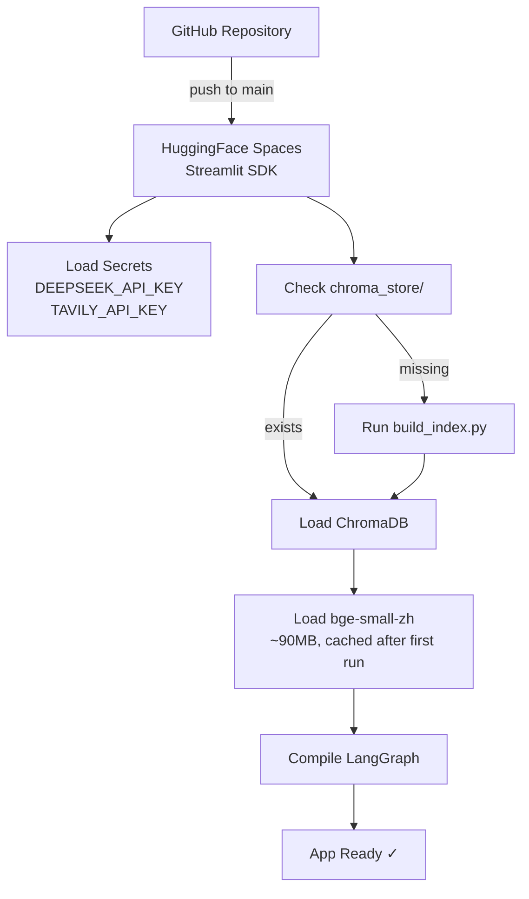

# DESIGN — Architecture Design Document

**See Also**: [`DIAGRAMS.md`](./DIAGRAMS.md) for visual representations


## Table of Contents

1. [System Overview](#1-system-overview)
2. [High-Level Architecture](#2-high-level-architecture)
3. [Component Design](#3-component-design)
4. [LangGraph State Design](#4-langgraph-state-design)
5. [Streaming Adapter](#5-streaming-adapter)
6. [Project Directory Structure](#6-project-directory-structure)
7. [Technology Decisions](#7-technology-decisions)
8. [Deployment Architecture](#8-deployment-architecture)


## 1. System Overview

The system is a **multi-agent conversational AI** built on a 4-layer architecture:

1. **Frontend Layer** — Streamlit chat UI (user interaction & streaming display)
2. **Orchestration Layer** — LangGraph StateGraph (intent routing + subgraph execution)
3. **Tool Layer** — ChromaDB RAG Engine + Tavily Web Search
4. **Model Layer** — DeepSeek-V3 (LLM) + bge-small-zh-v1.5 (Embedding)

The key design principle is **separation of concerns**: prompts, graph logic, RAG engine, and tools are independently modular so any component can be swapped without affecting others.


## 2. High-Level Architecture

> Full architecture diagrams in Mermaid format: [`DIAGRAMS.md`](./DIAGRAMS.md)

| Layer | Component | Responsibility |
|-------|----------|---------------|
| Frontend | Streamlit | Chat UI, streaming rendering, sidebar config, source display |
| Orchestration | LangGraph StateGraph | Intent routing (Supervisor) + subgraph execution (A/B/Direct) |
| Tool | ChromaDB RAG + Tavily | Local knowledge retrieval + online search fallback |
| Model | DeepSeek-V3 + bge-small-zh | LLM inference + text vectorization |

Inter-layer communication: Streamlit calls LangGraph via `stream_graph_to_streamlit()` thin adapter. LangGraph nodes share data through `TutorState`. Tools are invoked by nodes on demand.


## 3. Component Design

### 3.1 Supervisor Node

The Supervisor is the entry point for every user message. It performs LLM-based intent classification with few-shot prompting and structured JSON output, then sets `state.intent` to route to the appropriate subgraph.

```
Input:  state.messages (last human message)
Output: state.intent ∈ {"academic", "planning", "emotional"}
LLM:    DeepSeek-V3 with structured output
Prompt: src/prompts/supervisor.py
```

**Routing logic**:
- `academic` → SubGraph A
- `planning` → SubGraph B
- `emotional` → direct emotional response node
- Low confidence fallback → `academic`


### 3.2 SubGraph A — Academic Tutor

A 4-node subgraph for subject knowledge Q&A and past exam problem analysis.

```
Node 1: extract_keypoints
  Input:  state.messages[-1] (user question)
  Output: state.subject, state.keypoints (structured entities)
  LLM:    DeepSeek-V3 structured output

Node 2: rag_retrieve
  Input:  state.keypoints + state.subject
  Output: state.retrieved_docs (list of {content, source, score})
  Tool:   ChromaDB retriever (top-k=5, metadata filter by subject)
  Branch: distance > 0.7 → route to web_search node
          distance ≤ 0.7 → route to generate_answer node

Node 3a: web_search (conditional)
  Input:  state.messages[-1]
  Output: state.search_results
  Tool:   Tavily Search API

Node 3b: generate_answer
  Input:  state.messages + state.retrieved_docs + state.search_results
  Output: state.messages (appended AI response with citations)
  LLM:    DeepSeek-V3 streaming
  Prompt: src/prompts/academic.py
```


### 3.3 SubGraph B — Study Planner

A 3-node subgraph for generating personalized study plans enriched with latest Gaokao policy data.

```
Node 1: init_plan
  Input:  state.messages[-1] (user's goals/constraints)
  Output: state.plan (initial draft in Markdown)
  LLM:    DeepSeek-V3

Node 2: search_policy
  Input:  "latest Gaokao schedule policy {current_year}"
  Output: state.search_results (policy info)
  Tool:   Tavily Search API

Node 3: refine_plan
  Input:  state.plan + state.search_results
  Output: state.messages (final Markdown task list appended)
  LLM:    DeepSeek-V3
  Prompt: src/prompts/planner.py
```


### 3.4 Emotional Response Node

A single LLM call with a carefully designed system prompt for emotional support.

```
Input:  state.messages
Output: state.messages (appended AI response)
LLM:    DeepSeek-V3 streaming
Prompt: src/prompts/emotional.py
Persona: Experienced homeroom teacher — warm, practical, not overly sentimental
```


### 3.5 RAG Engine

Three-module RAG pipeline: document loading → indexing → retrieval.

```
loader.py
  - Supported formats: PDF (PyMuPDF), Markdown, TXT
  - Chunking: RecursiveCharacterTextSplitter
    chunk_size=1000, overlap=200
  - Metadata injection: {subject, source_file, year, doc_type}

indexer.py
  - Embedding: bge-small-zh-v1.5 (via HuggingFaceEmbeddings)
  - Vector store: ChromaDB, persist_directory="chroma_store/"
  - Collection: "gaokao_docs"
  - Supports incremental upsert (doc_id as dedup key)

retriever.py
  - Query: semantic similarity search, top-k=5
  - Filter: ChromaDB where clause (subject, year)
  - Threshold: distance > 0.7 → "no result" signal
  - Returns: List[{content, source, score}]
```


## 4. LangGraph State Design

The `TutorState` TypedDict is the single source of truth flowing through the entire graph. All nodes read from and write to this state object.

```python
from typing import TypedDict, Literal, Annotated
from langgraph.graph.message import add_messages

class TutorState(TypedDict):
    messages: Annotated[list, add_messages]       # Append-only via reducer
    intent: Literal["academic", "planning", "emotional"]
    subject: str                   # e.g. "math", "chinese"
    keypoints: list[str]           # e.g. ["quadratic functions", "discriminant"]
    retrieved_docs: list[dict]     # [{content, source, score}, ...]
    search_results: list[dict]     # [{title, url, content}, ...]
    plan: str                      # Initial draft plan in Markdown
```

**State flow summary**:
```
START
  └─ Supervisor: reads messages[-1], writes intent
       ├─ academic → SubGraph A
       │     ├─ extract_keypoints: writes subject, keypoints
       │     ├─ rag_retrieve: writes retrieved_docs
       │     ├─ [conditional] web_search: writes search_results
       │     └─ generate_answer: appends to messages
       ├─ planning → SubGraph B
       │     ├─ init_plan: writes plan
       │     ├─ search_policy: writes search_results
       │     └─ refine_plan: appends to messages
       └─ emotional → emotional_response: appends to messages
END
```

---

## 5. Streaming Adapter

LangGraph's built-in `stream()` and `astream_events()` mechanisms replace the need for any external Reactor/event-bus framework. A thin adapter function (~30 lines) bridges LangGraph events to Streamlit UI components.

**Three available stream modes**:

| Mode | Granularity | Use Case |
|------|------------|----------|
| `graph.stream(input)` | Node-level | Yields state delta after each node completes |
| `graph.astream_events(input)` | Token-level | LLM token-by-token streaming + tool call events |
| `graph.stream(input, stream_mode="updates")` | Update-level | Pushes only state changes, bandwidth-optimal |

**Why no Reactor framework needed**:
- Supervisor routing = event dispatcher (Reactor core pattern)
- LangGraph conditional edges = event routing table
- `stream()` yield mechanism = event callbacks
- An extra framework only adds complexity in a 24h sprint

**Thin adapter** lives at `src/graph/stream_adapter.py` (~30 lines):
- Calls `graph.stream(..., stream_mode="updates")` for node-level event stream
- Dispatches by `node_name`: Supervisor → `st.status()`; terminal nodes → `st.empty()` render
- After completion, shows RAG source citations via `st.expander` if `retrieved_docs` present


## 6. Project Directory Structure

```
gaokao_tutor/
├── app.py                          # Streamlit app entry point
├── requirements.txt                # Python dependencies
├── .env.example                    # Environment variable template
│
├── .streamlit/
│   ├── config.toml                 # Streamlit theme & config
│   └── secrets.toml                # API keys (.gitignore excluded)
│
├── src/
│   ├── __init__.py
│   │
│   ├── graph/                      # LangGraph orchestration layer
│   │   ├── __init__.py
│   │   ├── state.py                # TutorState TypedDict definition
│   │   ├── supervisor.py           # Supervisor node (intent routing)
│   │   ├── academic.py             # SubGraph A: Academic Tutor
│   │   ├── planner.py              # SubGraph B: Study Planner
│   │   ├── emotional.py            # Emotional response node
│   │   ├── stream_adapter.py       # Streaming adapter (LangGraph → Streamlit)
│   │   └── builder.py              # Graph construction & compilation
│   │
│   ├── rag/                        # RAG engine
│   │   ├── __init__.py
│   │   ├── loader.py               # Document loading (PDF/MD) + chunking
│   │   ├── indexer.py              # ChromaDB index building & persistence
│   │   └── retriever.py            # Retrieval interface
│   │
│   ├── tools/                      # LangChain Tools
│   │   ├── __init__.py
│   │   ├── rag_tool.py             # RAG retrieval tool
│   │   └── search_tool.py          # Tavily Web Search tool
│   │
│   └── prompts/                    # Prompt templates (centralized)
│       ├── __init__.py
│       ├── supervisor.py           # Intent routing prompt (few-shot)
│       ├── academic.py             # Subject tutor system prompt
│       ├── planner.py              # Study planner system prompt
│       └── emotional.py            # Emotional support system prompt
│
├── data/                           # Knowledge base source documents
│   ├── math/                       # Math past exams & syllabus PDFs
│   └── chinese/                    # Chinese past exams & syllabus PDFs
│
├── chroma_store/                   # ChromaDB persistence dir (.gitignore excluded)
│
├── scripts/
│   └── build_index.py              # Offline ChromaDB index builder
│
├── tests/
│   ├── test_graph.py               # LangGraph end-to-end tests
│   ├── test_rag.py                 # RAG engine unit tests
│   └── test_tools.py               # Tools layer unit tests
│
└── docs/                           # Engineering documentation
    ├── requirements/
    │   └── RPD.md                  # Requirements product document
    ├── architecture/
    │   ├── DESIGN.md               # Architecture design (this file)
    │   └── DIAGRAMS.md             # Flow & architecture diagrams (Mermaid)
    ├── development/
    │   ├── TODO.md                 # 24h Sprint task list
    │   └── TECH_STACK.md           # Technology decisions & dependencies
    └── assets/                     # Image resources
```


## 7. Technology Decisions

> Full decision records with alternatives, rationale, and code samples: [`../development/TECH_STACK.md`](../development/TECH_STACK.md)

Core choices: **DeepSeek-V3** (LLM), **ChromaDB** (vector store), **bge-small-zh-v1.5** (local embedding), **Tavily** (web search), **HuggingFace Spaces** (primary deployment).


## 8. Deployment Architecture

### Primary: HuggingFace Spaces



### Fallback: Streamlit Cloud

```
GitHub Repository → Streamlit Cloud (auto-deploy on push)
Secrets: DEEPSEEK_API_KEY, TAVILY_API_KEY
Note: 1GB RAM limit — monitor ChromaDB + bge model memory usage
```

### Environment Variables

| Variable | Description | Required |
|----------|-----------|----------|
| `DEEPSEEK_API_KEY` | DeepSeek API key | Yes |
| `DEEPSEEK_BASE_URL` | DeepSeek API endpoint (default: `https://api.deepseek.com`) | Yes |
| `TAVILY_API_KEY` | Tavily Search API key | Yes |
| `CHROMA_PERSIST_DIR` | ChromaDB persistence path (default: `chroma_store/`) | No |
| `EMBEDDING_MODEL` | Embedding model name (default: `BAAI/bge-small-zh-v1.5`) | No |

