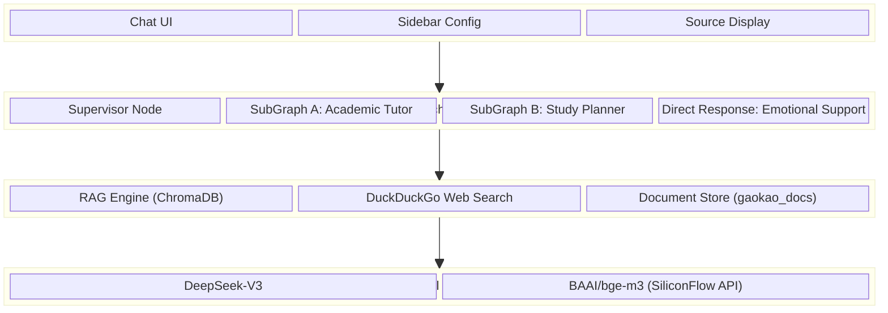
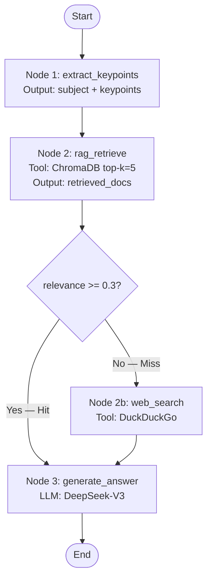
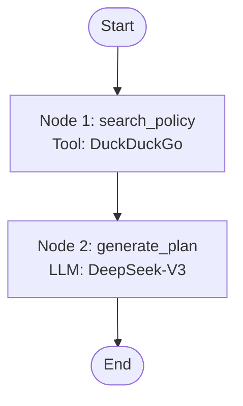

# DIAGRAMS — Architecture & Sub-graph Designs

## 1. System Architecture Overview

```mermaid
block-beta
    columns 1

    block:FRONTEND["Frontend Layer"]
        ChatUI["Chat UI"]
        Sidebar["Sidebar Config"]
        SourceDisplay["Source Display"]
    end

    space

    block:ORCHESTRATION["LangGraph Orchestration Layer"]
        Supervisor["Supervisor Node"]
        SubA["SubGraph A: Academic Tutor"]
        SubB["SubGraph B: Study Planner"]
        Direct["Direct Response: Emotional Support"]
    end

    space

    block:TOOLS["Tool Layer"]
        RAG["RAG Engine (ChromaDB)"]
        Search["DuckDuckGo Web Search"]
        DocStore["Document Store (gaokao_docs)"]
    end

    space

    block:MODELS["Model Layer"]
        LLM["DeepSeek-V3"]
        Embed["BAAI/bge-m3 (SiliconFlow API)"]
    end

    FRONTEND --> ORCHESTRATION
    ORCHESTRATION --> TOOLS
    TOOLS --> MODELS
```

## 2. SubGraph A — Academic Tutor

```mermaid
graph TD
    A_START([Start]) --> N1["Node 1: extract_keypoints<br/>Output: subject + keypoints"]

    N1 --> N2["Node 2: rag_retrieve<br/>Tool: ChromaDB top-k=5<br/>Output: retrieved_docs"]

    N2 --> COND{relevance >= 0.3?}

    COND -->|Yes — Hit| N4["Node 3: generate_answer<br/>LLM: DeepSeek-V3"]

    COND -->|No — Miss| N3["Node 2b: web_search<br/>Tool: DuckDuckGo"]

    N3 --> N4

    N4 --> A_END([End])
```

## 3. SubGraph B — Study Planner

```mermaid
graph TD
    B_START([Start]) --> P1["Node 1: search_policy<br/>Tool: DuckDuckGo"]

    P1 --> P2["Node 2: generate_plan<br/>LLM: DeepSeek-V3"]

    P2 --> B_END([End])
```
