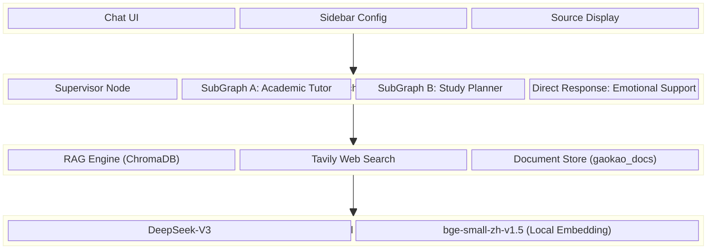
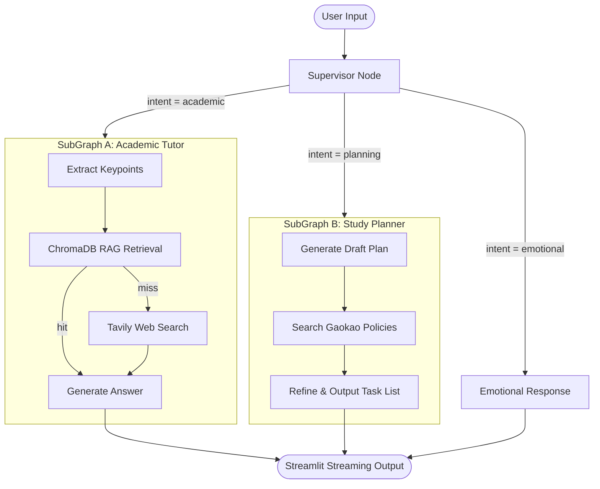
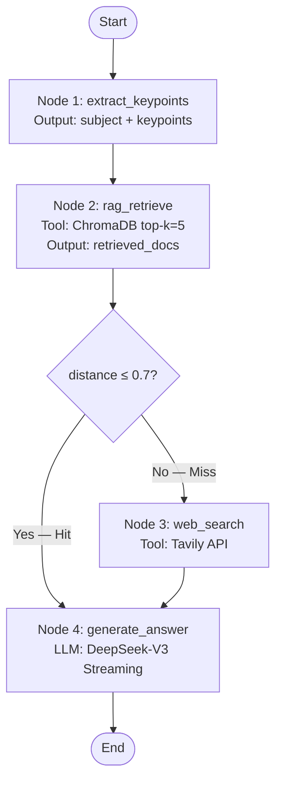
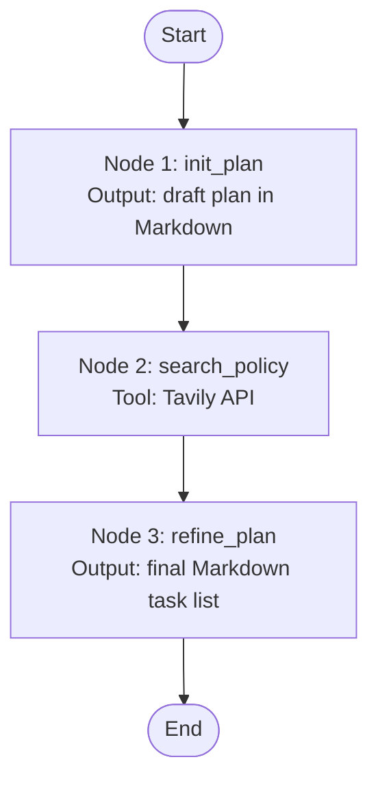
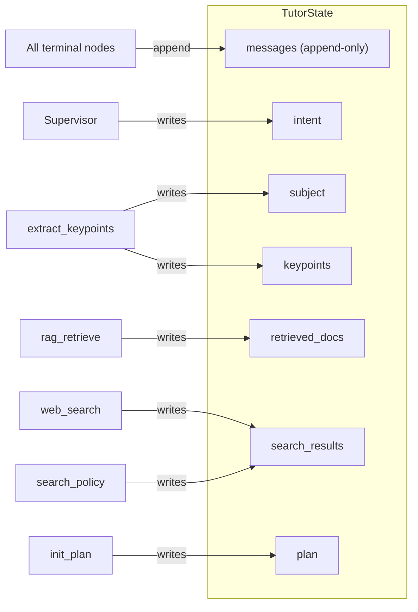
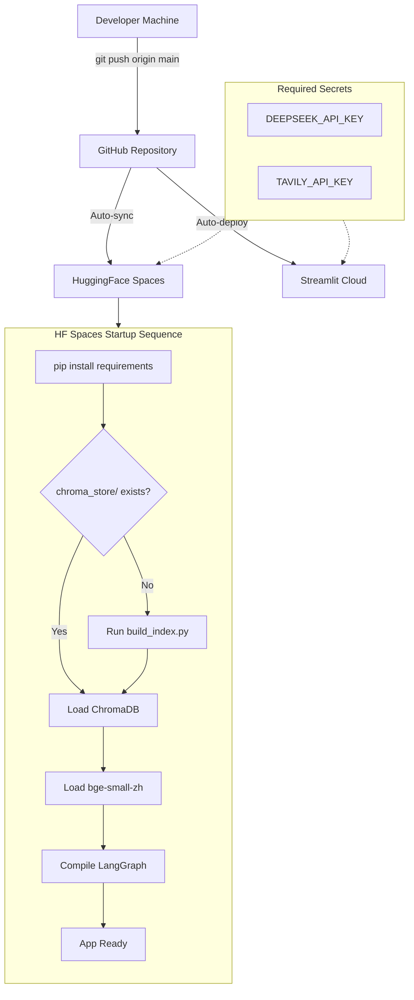

# DIAGRAMS — Architecture & Flow Diagrams

## 1. System Architecture Overview

## 2. LangGraph Main Flow

## 3. SubGraph A — Academic Tutor Internal Flow

## 4. SubGraph B — Study Planner Internal Flow

## 5. State Flow Diagram

## 6. Deployment Pipeline

