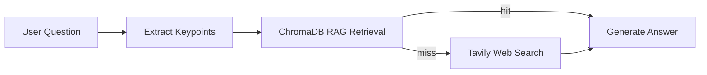

# RPD — Requirements Product Document

## Table of Contents

1. [Project Overview](#1-project-overview)
2. [Stakeholders & Users](#2-stakeholders--users)
3. [Project Scope](#3-project-scope)
4. [Functional Requirements](#4-functional-requirements)
5. [Non-Functional Requirements](#5-non-functional-requirements)
6. [MVP Definition](#6-mvp-definition)

## 1. Project Overview

**Gaokao Tutor** is an AI-powered tutoring assistant designed for Chinese high school students preparing for the National College Entrance Examination (Gaokao). Built with an agentic workflow architecture, it provides intelligent subject tutoring, personalized study planning, and emotional support through a conversational interface.

**Core Objective**: Deliver a fully functional, publicly accessible AI tutoring assistant within 24 hours using LangGraph + RAG + Web Search + Streamlit.

**Core Philosophy**: Agentic Workflows + Prompt Engineering — maximum capability with minimum code.

## 2. Stakeholders & Users

| Role | Description | Primary Need |
|------|-------------|-------------|
| Senior-year students | Preparing for Gaokao | Subject Q&A, past exam analysis, study plans |
| Gap-year students | Retaking the exam | Targeted practice on weak areas |
| Parents | Monitoring study progress | Understand plans, check Gaokao policies |
| Self-learners | Independent preparation | Knowledge supplementation, exam info queries |

## 3. Project Scope

### 3.1 In-Scope

| Dimension | Description |
|-----------|-------------|
| Core scenarios | 1) Subject knowledge Q&A & past exam analysis 2) Personalized study plan generation 3) Emotional support & casual chat |
| Subject coverage | MVP: 1-2 core subjects (Math + Chinese), extensible later |
| Knowledge sources | Local RAG (past exam PDFs, syllabus, study notes) + web search fallback |
| Deployment | HuggingFace Spaces (primary) / Streamlit Cloud (fallback), publicly accessible |
| Conversation mode | Multi-turn dialogue, streaming output, session-level context memory |

### 3.2 Out-of-Scope (explicitly excluded from 24h sprint)

| Excluded Item | Reason |
|--------------|--------|
| User auth / login system | Not needed in 24h, add later |
| Data persistence (grades, chat history) | `st.session_state` session-level memory is sufficient |
| Multimodal (image recognition, voice input) | High complexity, phase 2 |
| Full subject coverage (all 6 subjects) | MVP validates with 1-2 subjects first |
| Auto-grading / scoring system | Beyond 24h scope |
| Custom model fine-tuning | Use off-the-shelf LLMs directly |
| Mobile-specific adaptation | Streamlit's built-in responsive design is adequate |

### 3.3 Assumptions & Constraints

> Full technology decision records: [`../development/TECH_STACK.md`](../development/TECH_STACK.md)

| Constraint | Value |
|-----------|-------|
| LLM | DeepSeek-V3 (OpenAI-compatible API) |
| Vector store | ChromaDB + bge-small-zh-v1.5 (local embedding) |
| Web search | Tavily (**required**, LangChain native integration) |
| Knowledge base size | MVP ≤ 50 documents |
| Deployment platform | HuggingFace Spaces (primary) / Streamlit Cloud (fallback) |
| Concurrency | Single instance, no high-concurrency considerations |

## 4. Functional Requirements

### FR-1: Intent Recognition & Routing

The Supervisor Node uses an LLM with few-shot prompting and structured JSON output to classify user input into one of three intents and route accordingly.

| Intent | Route Target | Trigger Examples |
|--------|-------------|-----------------|
| `academic` | SubGraph A (Subject Tutor) | "How do I solve quadratic functions?", "Analyze this reading comprehension" |
| `planning` | SubGraph B (Study Planner) | "Make me a review plan for next week", "When is this year's Gaokao?" |
| `emotional` | Direct emotional support reply | "I'm so anxious", "I feel like I can't learn anything" |

- **Prompt strategy**: Few-shot (3+ examples per intent) + structured output (JSON mode)
- **Target accuracy**: > 90%
- **Fallback**: Low confidence routes to `academic` by default

### FR-2: Academic Tutor Workflow (SubGraph A)

Handles subject knowledge questions and past exam problem analysis with RAG-first retrieval and web search fallback.

**Detailed requirements**:

- **Keypoint extraction**: Extract subject, knowledge points, question type from user input (LLM structured output)
- **RAG retrieval**: top-k = 3~5, metadata filtering (subject, year, type), source citations; distance > 0.7 triggers web search
- **Web search fallback**: Tavily API returns latest relevant content
- **Answer generation**: Detailed solution with step-by-step reasoning, knowledge point connections, common mistakes; streaming output

### FR-3: Study Planner Workflow (SubGraph B)

Generates personalized study plans combining the student's goals with the latest Gaokao policy information retrieved via web search.

**Output format**: Structured Markdown task list with timeline (daily/weekly), priority labels, and subject distribution.

### FR-4: Emotional Support

Detects emotional distress signals (anxiety, frustration, burnout) and responds with warm, practical encouragement in the persona of an experienced homeroom teacher.

- Balances emotional support with practical study advice
- Trigger keywords: anxious, overwhelmed, can't learn, give up, stressed

### FR-5: Streamlit Frontend

A clean, responsive chat interface built with Streamlit, featuring streaming output, source citation display, and sidebar configuration.

| Component | Specification |
|-----------|--------------|
| Chat interface | `st.chat_message` + `st.chat_input`, renders message history |
| Streaming output | `st.empty()` + LangGraph `stream()`, progressive rendering |
| Source citations | `st.expander` showing RAG-retrieved document snippets + source filenames |
| Sidebar | Subject selection, mode toggle (Q&A / Planning), clear chat button |
| Node status | `st.status()` showing current execution node ("Searching...", "Generating...") |

## 5. Non-Functional Requirements

| Dimension | Requirement | Implementation |
|-----------|------------|----------------|
| Response speed | First token < 2s (perceived via streaming) | LLM Streaming + LangGraph async |
| Security | API keys never hardcoded or in Git history | `st.secrets` (HF/Streamlit) + `.env` (local) |
| Extensibility | Add subject = add `data/` docs + adjust prompt, no code changes | ChromaDB metadata design + `prompts/` directory separation |
| Maintainability | Prompts fully decoupled from business logic | `src/prompts/` independent directory |
| Cost control | Monthly cost < ¥30 | DeepSeek-V3 + bge-small-zh local embedding (zero cost) |
| Deployment ease | Push to GitHub triggers auto-deploy | HuggingFace Spaces CI/CD |
| Observability | Key node execution status visible | `st.status()` + LangGraph node names |

## 6. MVP Definition

If time is limited, the following represents the absolute minimum viable product:

| Priority | Requirement | Fallback |
|----------|------------|----------|
| P0 — Must | Basic Streamlit chat interface (input + display reply) | — |
| P0 — Must | Supervisor intent routing (at least distinguish "academic" vs "other") | — |
| P0 — Must | SubGraph A core (RAG retrieval + DeepSeek answer generation) | — |
| P0 — Must | At least 1 past exam PDF indexed in ChromaDB | — |
| P0 — Must | Streaming output working | — |
| P1 — Important | Tavily Web Search fallback | Return "No relevant data found, please rephrase" |
| P1 — Important | Emotional support routing | Merge into default reply with warm tone |
| P2 — Defer | SubGraph B full study planning flow | Replace with single LLM prompt |
| P2 — Defer | Full sidebar configuration | Keep only clear chat button |
| P3 — Wrap-up | Deploy online, README, CHANGELOG | Local demo is sufficient for validation |

